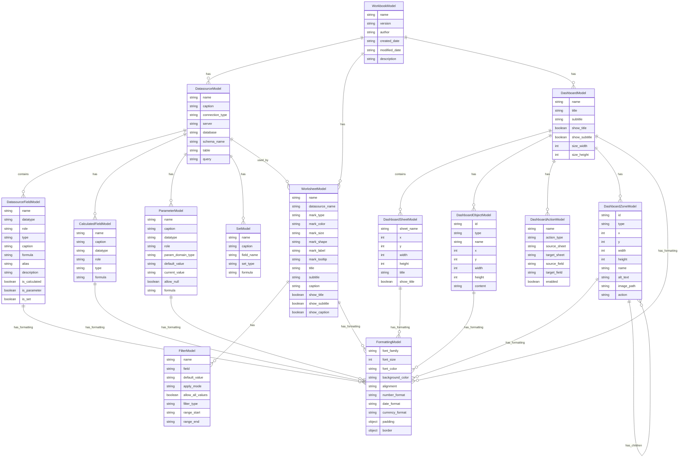

# tabtest データモデル ER図

## 主要なエンティティの説明

### 1. WorkbookModel（ワークブック）
- Tableauワークブック全体を表すルートエンティティ
- メタデータ（バージョン、作成者、作成日など）を含む
- 他のすべてのエンティティの親

### 2. DatasourceModel（データソース）
- データ接続情報を管理
- 接続タイプ、サーバー、データベース、テーブル情報を含む
- 複数のフィールド、計算フィールド、パラメータ、セットを持つ

### 3. DatasourceFieldModel（データソースフィールド）
- データソース内の各フィールドを表す
- データ型、役割、計算式、別名などの情報を含む
- 計算フィールド、パラメータ、セットの識別フラグを持つ

### 4. WorksheetModel（ワークシート）
- 個別のワークシートを表す
- マークタイプ、色、サイズ、形状などの視覚的設定を含む
- タイトル、サブタイトル、キャプションの表示設定を持つ

### 5. DashboardModel（ダッシュボード）
- ダッシュボード全体を表す
- サイズ、タイトル、サブタイトルの設定を含む
- 複数のシート、オブジェクト、アクション、ゾーンを持つ

### 6. FilterModel（フィルター）
- ワークシートのフィルター設定を表す
- フィルタータイプ、値、範囲設定を含む

### 7. ParameterModel（パラメータ）
- データソースのパラメータを表す
- ドメインタイプ、デフォルト値、現在の値を含む

### 8. SetModel（セット）
- データソースのセットの定義を表す
- 対象フィールド、メンバー、計算式を含む

### 9. CalculatedFieldModel（計算フィールド）
- データソースの計算フィールドの定義を表す
- 計算式、データ型、役割を含む

### 10. FormattingModel（書式設定）
- 各エンティティの書式設定を表す
- フォント、色、配置、フォーマット設定を含む

### 11. DashboardObjectModel（ダッシュボードオブジェクト）
- ダッシュボード内の個別オブジェクトを表す
- 位置、サイズ、コンテンツを含む

### 12. DashboardActionModel（ダッシュボードアクション）
- ダッシュボードのアクション設定を表す
- ソース/ターゲット情報を含む

### 13. DashboardZoneModel（ダッシュボードゾーン）
- ダッシュボードのゾーン情報を表す
- 位置、サイズ、タイプを含む
- 階層構造をサポート（子ゾーンを持つ）

## 主要なリレーションシップ

1. **Workbook → Datasource**: 1対多（1つのワークブックは複数のデータソースを持つ）
2. **Workbook → Worksheet**: 1対多（1つのワークブックは複数のワークシートを持つ）
3. **Workbook → Dashboard**: 1対多（1つのワークブックは複数のダッシュボードを持つ）
4. **Datasource → DatasourceField**: 1対多（1つのデータソースは複数のフィールドを持つ）
5. **Datasource → CalculatedField**: 1対多（1つのデータソースは複数の計算フィールドを持つ）
6. **Datasource → Parameter**: 1対多（1つのデータソースは複数のパラメータを持つ）
7. **Datasource → Set**: 1対多（1つのデータソースは複数のセットを持つ）
8. **Dashboard → DashboardSheet**: 1対多（1つのダッシュボードは複数のシートを含む）
9. **Dashboard → DashboardObject**: 1対多（1つのダッシュボードは複数のオブジェクトを持つ）
10. **Worksheet → Filter**: 1対多（1つのワークシートは複数のフィルターを持つ）
11. **FormattingModel**: 多対1（複数のエンティティが書式設定を持つ）

## データ構造の変更点

### 🔄 **データソースレベルでの管理**
- **計算フィールド**: データソースに紐づいて管理
- **パラメータ**: データソースに紐づいて管理  
- **セット**: データソースに紐づいて管理

### 📊 **リレーションシップの改善**
- **Datasource(1) : CalculatedField(多)**: 1つのデータソースは複数の計算フィールドを持つ
- **Datasource(1) : Parameter(多)**: 1つのデータソースは複数のパラメータを持つ
- **Datasource(1) : Set(多)**: 1つのデータソースは複数のセットを持つ

### 🎯 **メリット**
1. **論理的な構造**: Tableauの実際の構造に近い
2. **スコープの明確化**: 各データソースの範囲が明確
3. **保守性の向上**: データソース単位での管理が容易
4. **拡張性**: 新しいデータソースの追加が簡単

このER図は、Tableauワークブックの複雑な構造をより正確に表現し、pytestでのテストに必要なすべての情報をカバーしています。
